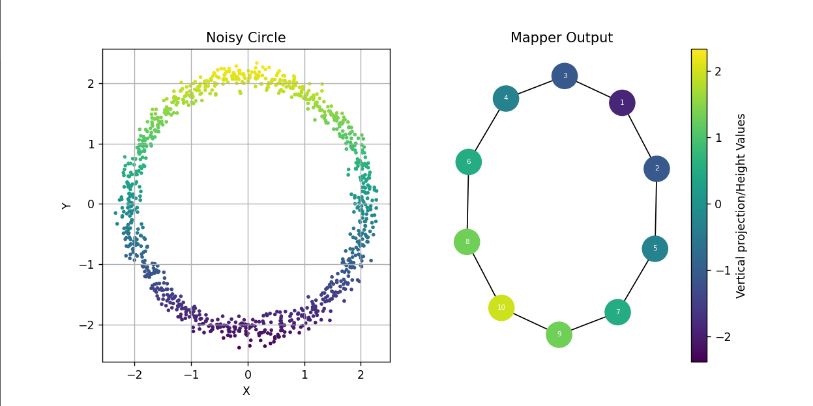

# Mapper-TDAw
## Background

This is an implementation of the statistical version of 'Mapper' as described in [Topological Methods for the Analysis of High Dimensional Data Sets and 3D Object Recognition](https://www.researchgate.net/publication/221571174_Topological_Methods_for_the_Analysis_of_High_Dimensional_Data_Sets_and_3D_Object_Recognition) by Gurjeet Singh, Facundo Mémoli, and Gunnar Carlsson. 'Mapper' is a technique in Topological Data Analysis (TDA) aimed at reducing higher-dimensional datasets into simpler forms while preserving certain geometrical and topological properties. The topological version refers to a theoretical construction, while the statistical version refers to the point cloud analogue.

## Brief Explanation

Let X be the set of data points. We take a function f: X --> R as the filter function, where R is the target parameter space.

Let B be a cover of I (the range of the filter function restricted to points in X), with the size of intervals in B denoted as l and the overlap ratio between adjacent intervals denoted as r. Using the inverse filter f^-1 on B, we get a covering A of X.

Choose a clustering algorithm with an appropriate threshold and get clusters for the subsets of X present in A. Represent the clusters by vertices (0-simplices) and add an edge between 2 vertices if the corresponding clusters have a non-empty intersection. This results in a graph, i.e., a simplicial complex of dimension at most one, that captures topological properties of the dataset such as the number of connected components and the number of loops.

To obtain information on higher-dimensional voids, we need to create a higher-dimensional simplicial complex. One way to achieve this is to use more than one filter function.

Higher-dimensional simplicial complexes are difficult to visualize on a 2D surface (like a monitor); hence, we limit ourselves to 1D simplicial complexes in this implementation.
## How to Run

1. Clone this repository.
2. Run the following commands to ensure all dependencies are installed:
    ```sh
    chmod +x install_dependencies.sh
    ./install_dependencies.sh
    ```
3. Run: ```cd main```
4. In `main.py`, there are different examples commented out. Uncomment any one.
5. Run:
    ```sh
    python main.py
    ```

One can specify their own dataset and filters.

## Some Results
Here are some of the examples tested.

1. Noisy circle of radius 2.1, with 1000  points. 
<p align="center">

</p>
We apply mapper on it with length of interval as 1, overlap ratio as 0.2.

<p align="center">

</p>
Similarly, 

2. 
Applying mapper on a pair of internally touching circles with length of interval: 2.0 and overlap ratio: 0.2
<p align="center">

</p>

The way we find cover of data points X can be visualized as: 

<p align="center">

</p>

3. Following is a 2 armed spiral, not joined at the center. We apply mapper on it with filter function same as earlier i.e. height function. Length of interval: 2.5, overlap ratio: 0.07.
<p align="center">

</p>
The output of Mapper kind of unentangles the 2 arms, revealing 2 connected components. Similarly, for the 4-armed spiral given below,

4.  Length of interval: 10.5, overlap ratio: 0.07. The output reveals 4 connected components.
<p align="center">

</p>


## Note
The output of Mapper is a multiresolution image. In order to get the correct simplification, the choice of resolution-controlling parameters like the size of the interval and overlap ratio play a major role.
